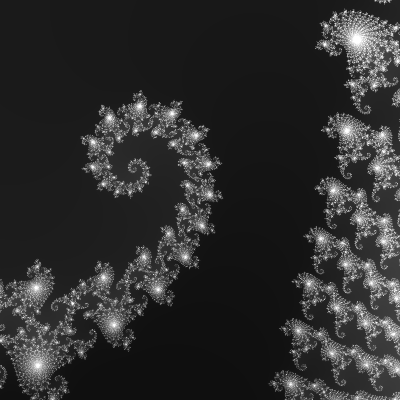

这是一个生成分型图片，并对其进行Gamma矫正和Tint着色的程序

其中涉及TBB的是时刻查询

```c++
//t0时刻
tbb::tick_count t0 = tbb::tick_count::now();	
...
//当前时刻-t0时刻=经过了多长时间段（并转化为秒）
std::cout << "Time: " << (tbb::tick_count::now() - t0).seconds() << " seconds" << std::endl;
```


